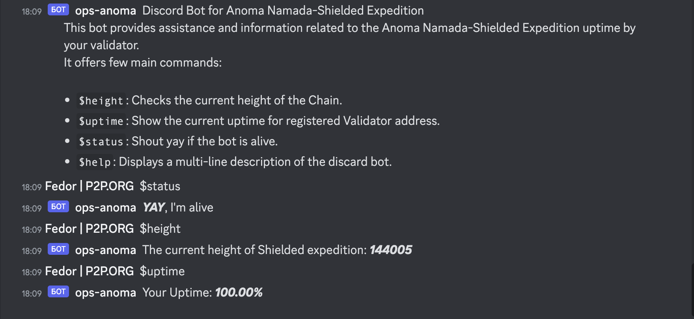

# Anoma Namada-Shielded Expedition Discord Bot

This is a Discord bot that provides assistance and information related to the Anoma Namada-Shielded Expedition uptime by your validator.

## Commands

- `$height`: Checks the current height of the Chain.
- `$uptime`: Show the current uptime for registered Validator address.
- `$status`: Shout yay if the bot is alive.
- `$help`: Displays a multi-line description of the discard bot.

## Setup

1. Clone the repository.
2. Install Rust and Cargo if you haven't already.
3. Run `cargo build` to build the project.
4. Set up your environment variables in a `.env` file in the root of the project. See `env-locals` for an example.
5. Run `cargo run` to start the bot.

## Environment Variables

See `.env-locals` for an example of how to set up your environment variables. You'll need to set the following:

- `DISCORD_TOKEN`: Your Discord bot token.
- `RPC_ENDPOINTS`: List of available rpc endpoints, polled every 5 seconds for viability
- `VALIDATOR_ADDRESS`: Your validator address for watcher

## Example

This is an example of a bot in action.

## Contributing

Pull requests are welcome. For major changes, please open an issue first to discuss what you would like to change.

Please make sure to update tests as appropriate.

## License

This project is open source and available under the [Apache License 2.0](https://opensource.org/licenses/Apache-2.0).
